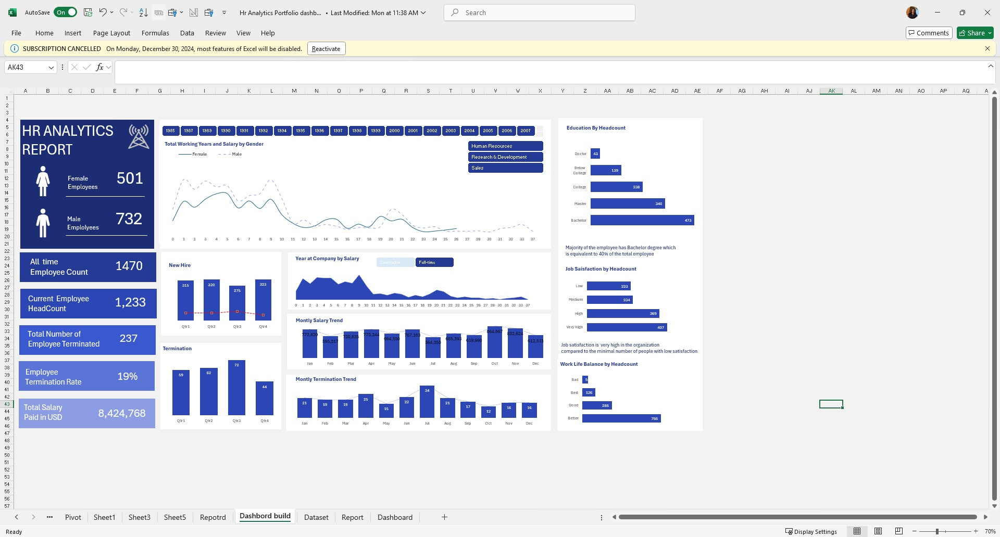

# HR ANALYTICS PROJECT

## Introduction

Utilizing spreadsheets for data analytic

[Here]( https://d.docs.live.net/304a10fdc3626a0e/Hr%20Analytics%20Portfolio%20dashboard.xlsx) is the link to the Excel sheet

## Project Overview
This HR Analytics project focuses on key metrics to evaluate employee performance and organizational efficiency.
The goal is to provide insights into workforce trends and help in making informed decisions for talent management.

## Ask Phase

**Business would like to see the following trend**:

*How many employees does the organization have at a given time (Total Employee Headcount)

*What is the current turnover rate (Termination and Termination Rate)?

*Are salary levels distributed equitably across departments and job levels (Salary Analysis)

## Prepare

**The required data include**:

1. Total Employee

2. Headcount

3. Termination

4. Termination Rate

5. Salary

## Visualization

## Key observations
High Termination Rate (19%): A termination rate of 19% is on the higher side, which could indicate potential issues with employee retention. Typically, companies aim for a termination rate below 10-15%, depending on the industry. A 19% rate suggests that nearly 1 in 5 employees are leaving the company.

Large Salary Expenditure: The total salary of $8,424,768 for 1,470 employees means the average salary per employee is around $5,731. While this might be in line with industry standards, it’s important to assess whether the compensation is competitive, as salary is often a key driver of employee satisfaction and retention.

## Recommendation

Conduct Exit Interviews: Since the termination rate is high, exit interviews should be conducted with employees who have left to better understand why they are leaving. Common reasons might include dissatisfaction with the work environment, lack of growth opportunities, or uncompetitive salaries.

Review Compensation Structure: The average salary appears relatively modest at $5,731 per employee. It may be beneficial to benchmark your company's salaries against industry standards to ensure competitiveness. If salaries are below market rate, this could be contributing to the high turnover rate.

Improve Employee Engagement: Engage with the current workforce to understand their pain points. You can use surveys or focus groups to identify areas where employees may feel disengaged. Consider offering career development opportunities, recognition programs, or better work-life balance initiatives.

Enhance Retention Strategies: Given the high termination rate, developing retention programs could be essential. This could include mentorship programs, leadership development opportunities, and benefits like flexible work arrangements or wellness initiatives.

Thank you 😄 😃
